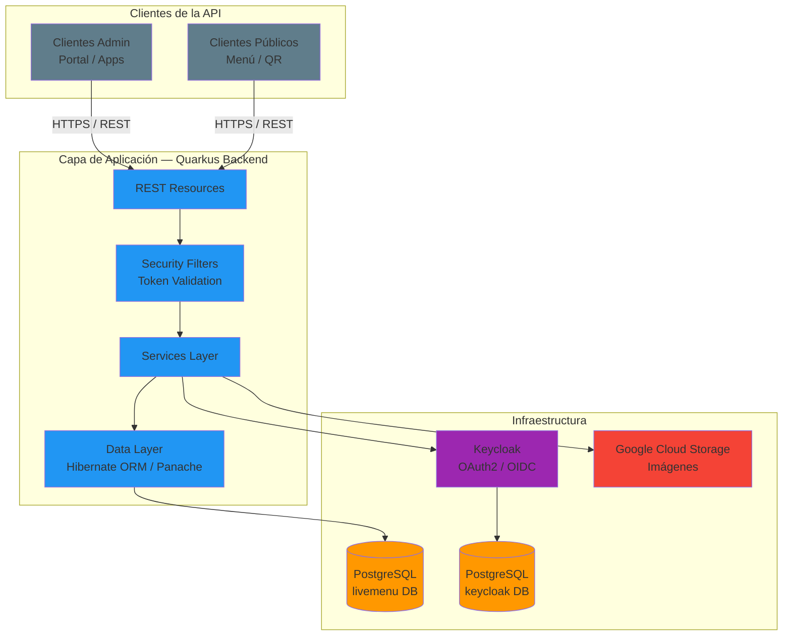
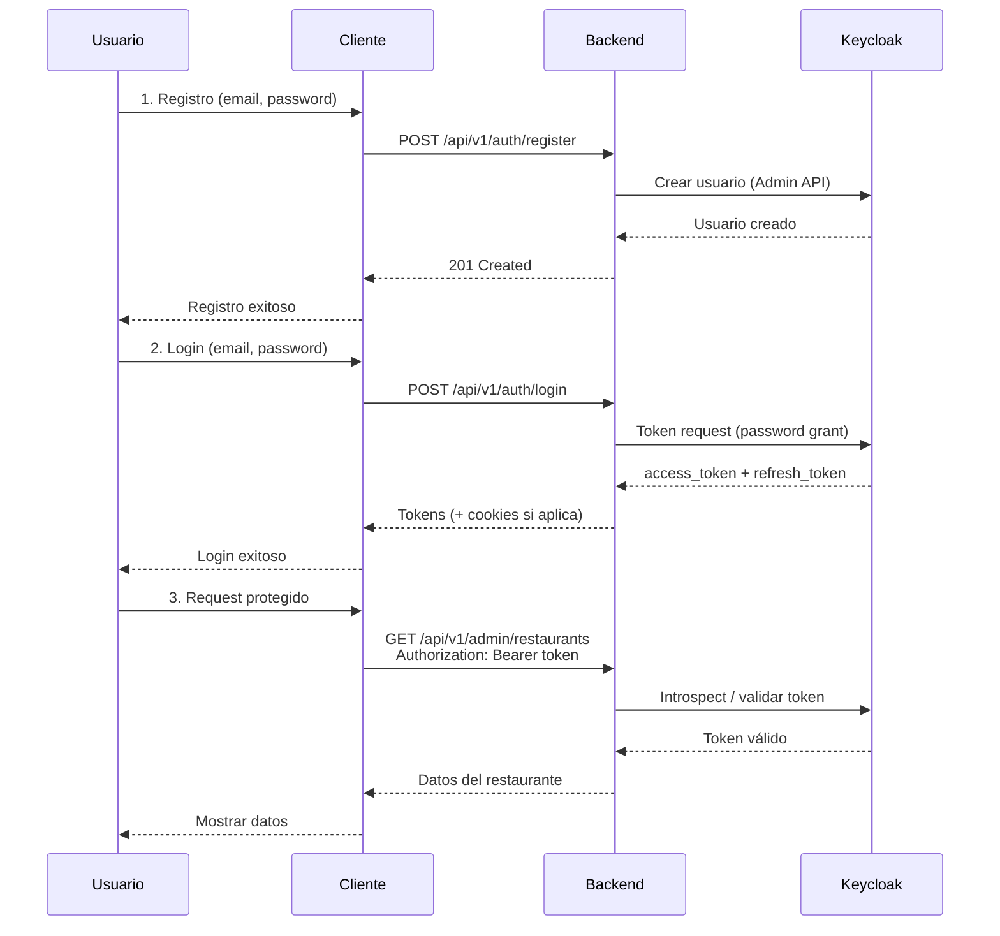
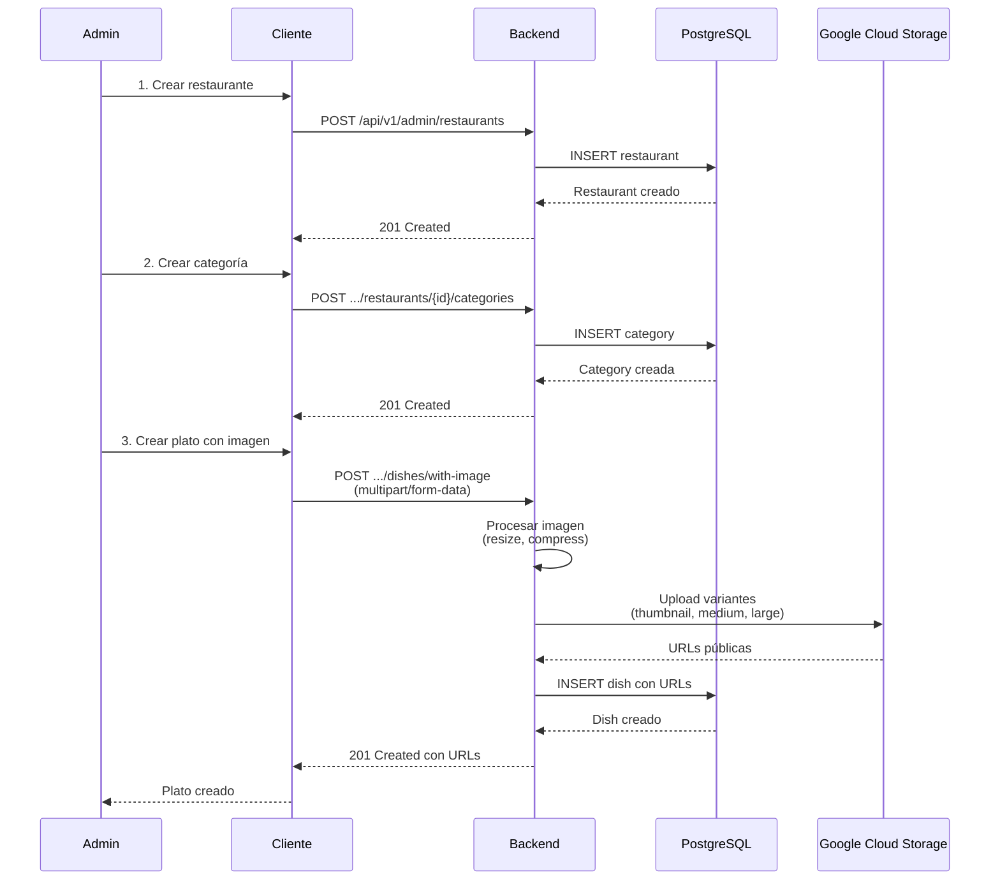
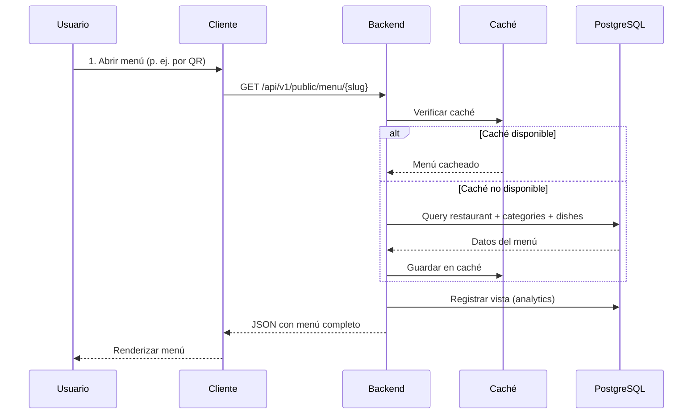
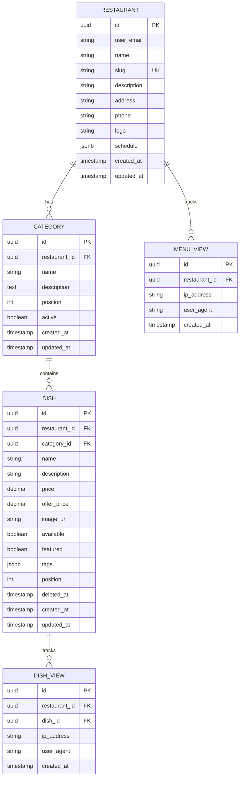
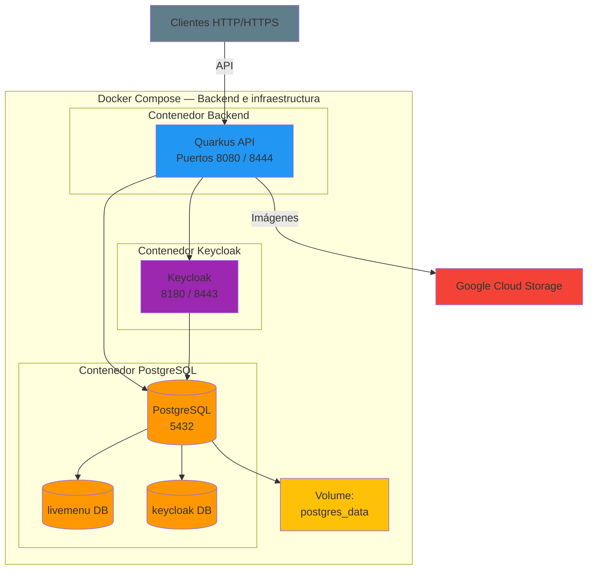
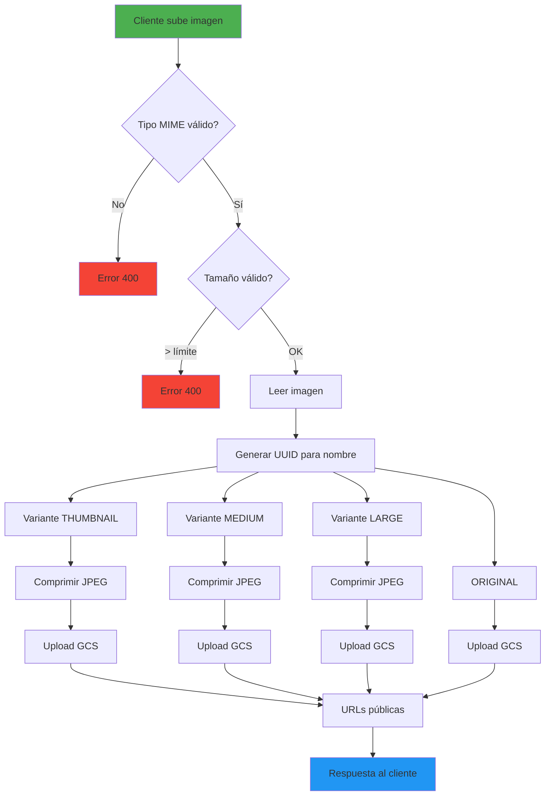
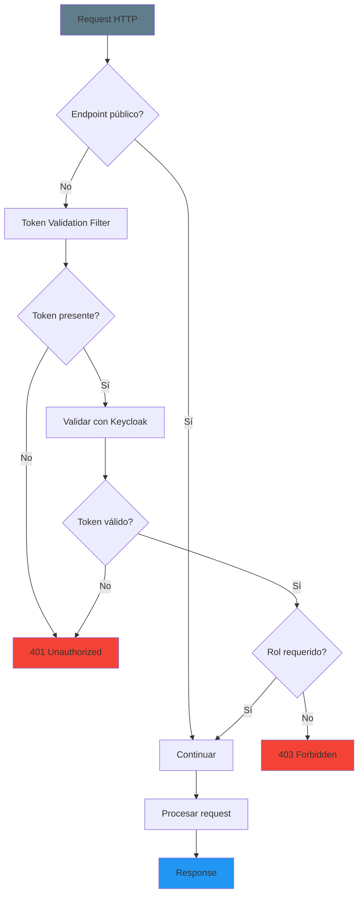

# Diagramas de Arquitectura — Backend LiveMenu

Este documento contiene diagramas de la **arquitectura del backend** LiveMenu (API Quarkus) en formato Mermaid: componentes, flujos, modelo de datos, despliegue con Docker Compose, procesamiento de imágenes y seguridad.

---

## Diagrama de Componentes (Backend)

---

## Diagrama de Flujo de Autenticación

---

## Diagrama de Flujo de Gestión de Menú

---

## Diagrama de Flujo de Vista Pública

---

## Diagrama de Arquitectura de Datos

Las tablas y campos coinciden con las entidades del backend (ver [HIBERNATE.md](HIBERNATE.md)).

---

## Diagrama de Deployment (Docker Compose — Backend)

Solo servicios del backend y su infraestructura (sin frontend).

---

## Diagrama de Procesamiento de Imágenes

---

## Diagrama de Seguridad (Token y Filtros)

---

## Notas

### Convenciones de color
- **Gris (#607D8B):** Clientes / entrada.
- **Azul (#2196F3):** Backend (Quarkus).
- **Naranja (#FF9800):** Base de datos.
- **Morado (#9C27B0):** Keycloak / autenticación.
- **Rojo (#F44336):** GCS / errores.
- **Amarillo (#FFC107):** Volúmenes / persistencia.

### Cómo visualizar
Los diagramas están en **Mermaid** y se renderizan en:
- GitHub / GitLab (preview del `.md`).
- VS Code con extensión "Markdown Preview Mermaid Support".
- [mermaid.live](https://mermaid.live).

### Relación con el código
- Entidades y tablas: [docs/HIBERNATE.md](HIBERNATE.md).
- Despliegue y variables: [README.md](../README.md) y [compose/CONFIG-LOGIN-DOCKER.md](../compose/CONFIG-LOGIN-DOCKER.md).
